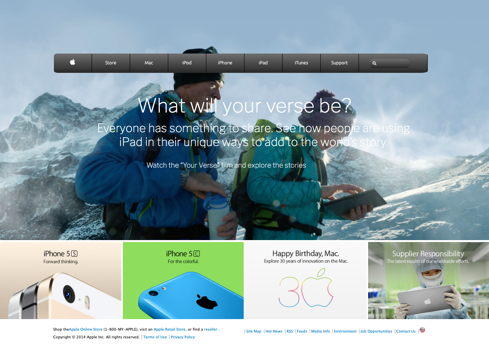

# Old Apple-page

> This is the fourth collaborative project from Microverse program.
> A mock-up of an Old Apple page.

## Built With :

 - **Html** & **CSS**
 - Using background and gradients.
 - -   StyleLinters.
   - W3 HTML Validation Service.

## Demo Link:
[You can find the project live here](https://raw.githack.com/Fanger53/apple-page/features/index.html)

## Authors  

👤 Author1

Github: @elasfarc  

👤 Author2

Github: https://github.com/Fanger53

Twitter: https://twitter.com/DavidLe97005129

Linkedin: https://www.linkedin.com/in/david-castillo-61ba10b8/

## 🤝 Contributing
Contributions, issues and feature requests are welcome!
Feel free to check the issues page.

## Show your support ⭐️
Give a ⭐️ if you like this project!  

## Acknowledgments
Hat tip to anyone whose code was used Inspiration etc 📝 License This project is MIT licensed.
